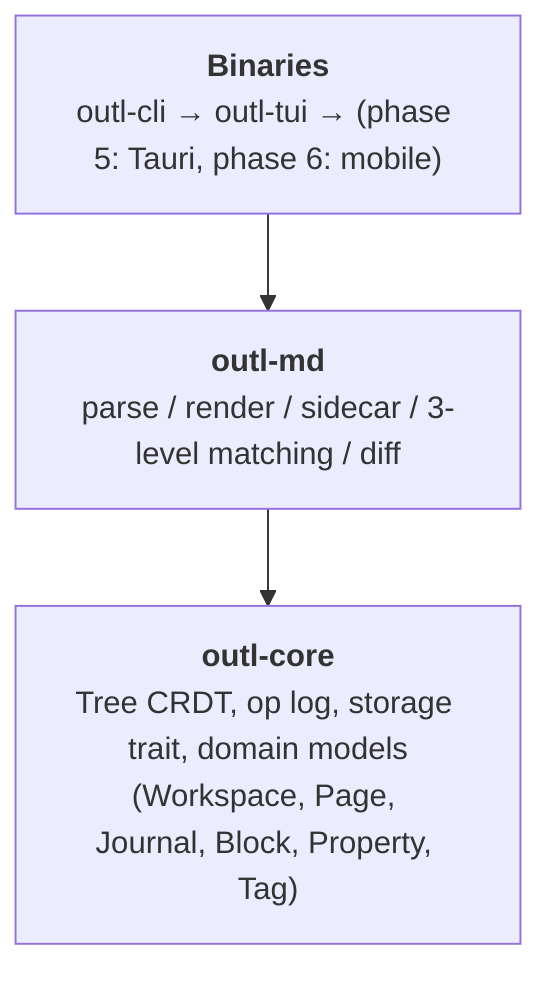
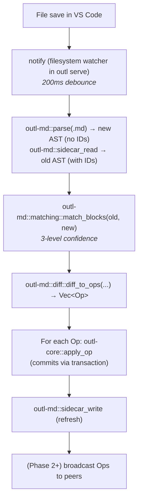

# Architecture

High-level structure and the major design decisions behind it.

## Overview

outl is split into four crates:



`outl-core` knows nothing about files, markdown, or networks.
`outl-md` knows about markdown and sidecars but nothing about TUI or IPC.
`outl-cli` and `outl-tui` are I/O shells around the two libraries.

This split exists so phase 2 (P2P sync) and phases 5–6 (Tauri, mobile) can
reuse the same core without inheriting CLI baggage.

---

## Major design decisions

These were locked in before code shipped. Don't unilaterally pivot — ask
first.

### 1. Markdown is source of truth

The user's words live in `.md` files. The op log is **derived** from
user-facing operations. If we lose the op log, we can reconstruct the
current state from `.md` + sidecar.

**Trade-off:** the file system is the canonical interface. We accept the
overhead of writing `.md` after every op. The alternative (DB-only) is what
Logseq moved to and what broke their community.

### 2. Op log lives in SQLite (default)

Phase 1 uses a single `.outl/log.db` file in the workspace. WAL mode,
ACID, concurrent reads. Boring, proven, embeddable, zero-config.

**Trade-off:** SQLite is great until you want git-style history-as-feature.
That's why `Storage` is a trait — `ChronDbStorage` (issue #1) can replace
it later without touching `outl-core` logic.

### 3. `Storage` is a trait, not a concrete struct

```rust
trait Storage: Send + Sync {
    fn append_op(&mut self, op: &LogOp) -> Result<()>;
    fn ops_since(&self, ts: HLC) -> Result<Vec<LogOp>>;
    // ...
}
```

`outl-core` consumes `dyn Storage`. The sqlite implementation lives in
`storage/sqlite.rs` and is the only place in the crate that touches
`rusqlite`.

**Why:** swapping backends is a single-file change. Test doubles are
trivial. Phase 2's sync code can mock storage. Future ChronDB integration
is a PR adding `storage/chrondb.rs`.

### 4. Sidecar JSON instead of inline IDs

Logseq writes `id:: 01HXY...` lines into the `.md`. We refused that.

We write the IDs into a sidecar file `.foo.outl` (dotfile, JSON). The
`.md` stays clean. VS Code shows what the user wrote. GitHub renders it
beautifully. Obsidian doesn't get confused. The sidecar is hidden by
default in `ls`.

**Trade-off:** external edits require **matching** to reconstruct IDs.
That's a real algorithm (`outl-md/src/matching.rs`) with three confidence
levels and an orphan log. It's more work than inline IDs, but the user
experience is dramatically better.

### 5. Tree CRDT specifically, not a generic CRDT

We could use a generic op-based CRDT (Automerge). We chose to implement
Kleppmann 2022 directly because:

- The paper is short and the algorithm fits in ~300 lines of Rust.
- Domain-specific = better error messages, simpler API.
- We control the on-disk format (op log schema).
- No transitive deps on a heavyweight CRDT framework.

**Trade-off:** we're on the hook for correctness. That's why the test
battery is huge and the coverage target on the four critical functions is
100%.

### 6. Yrs for block text content

Tree CRDT moves blocks. Yrs (Yjs in Rust) handles concurrent edits to the
text **inside** a block. Combining them gives us:

- Block-level structure: tree CRDT.
- Character-level text: Yrs.

Yrs is mature, battle-tested in Yjs-based apps. Reusing it lets us focus
on the part nobody else has solved (the tree).

### 7. ULID for IDs

128 bits, lexicographically sortable, monotonic per millisecond, no central
authority. Better than UUIDv4 (random, sorting nightmare) and better than
UUIDv7 (good but ULID is established and the spec is finalized).

### 8. uhlc for timestamps

Hybrid Logical Clock = wall clock + logical counter + actor. Comparing two
HLCs gives a total order without coordination, and the wall-clock
component keeps timestamps human-meaningful for debugging.

### 9. Journal is a first-class concept

Daily notes (`2026-05-24.md`) live in `<workspace>/journals/`, separate
from `<workspace>/pages/`. Navigation keys `[`, `]`, `t` are dedicated to
journals. When you open `outl-tui`, you land on today's journal.

This isn't an afterthought — it's the primary input path for the user's
day-to-day notes. Anything that makes journal access slow or hidden is
wrong.

### 10. MIT license

One license, no dual-license boilerplate to maintain, no patent grant
language to argue about. Permissive enough for any downstream — including
plugin authors who want to relicense their own crates differently.

### 11. iroh for P2P (phase 2)

QUIC, hole punching, no central servers, no STUN/TURN dependency in the
common case, in Rust, BSD-licensed. The alternatives are heavier (libp2p)
or non-Rust.

### 12. Tauri for desktop (phase 5)

Rust core reuse, smaller binary than Electron, native webview. Slightly
worse UX consistency than fully-native, but acceptable for an outliner
where the bulk of the UX is text and lists.

### 13. uniffi for mobile (phase 6)

Single FFI surface (Mozilla's approach in Firefox mobile). Native UI on
each platform (SwiftUI on iOS, Compose on Android). Rust core unchanged.

---

## Data flow

### User types in TUI (write path)


### User edits .md in VS Code (read-from-disk path)



---

## Concurrency model (single device, phase 1)

- `outl serve` owns the file watcher and the write-through pipeline.
- `outl-tui` reads through `Workspace` (which wraps a `Mutex<Storage>` or
  similar).
- A single sqlite file with WAL mode allows concurrent reads from TUI
  while the watcher is writing.
- Phase 2 adds the sync transport as another writer; storage gains a
  per-op lock.

---

## Error handling philosophy

- `thiserror` for typed errors in libs.
- `anyhow` only at the binary boundary (CLI prints errors with context).
- No `unwrap()` in non-test code.
- A corrupt sidecar is **recoverable**: `outl doctor` regenerates it from
  the op log. Don't crash, log + fall back.
- A corrupt op log is **catastrophic** but we surface it loudly via
  `outl doctor` so the user can intervene before further writes.

---

## Future considerations (documented, not built)

- **End-to-end encryption** of sync traffic — iroh supports it, we'll
  enable.
- **Per-workspace identity** — each device gets a stable ActorId stored in
  `.outl/config.toml`.
- **Read-only export** — Hugo, static HTML, PDF.
- **Plugin system** — `rhai` scripts that consume op stream, expose new
  query types, render hooks for TUI. Phase 4.
