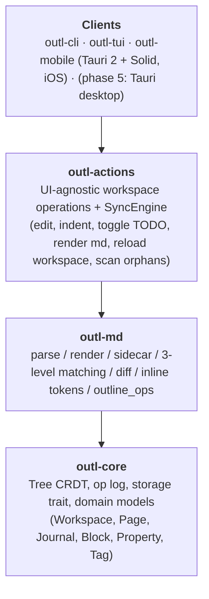
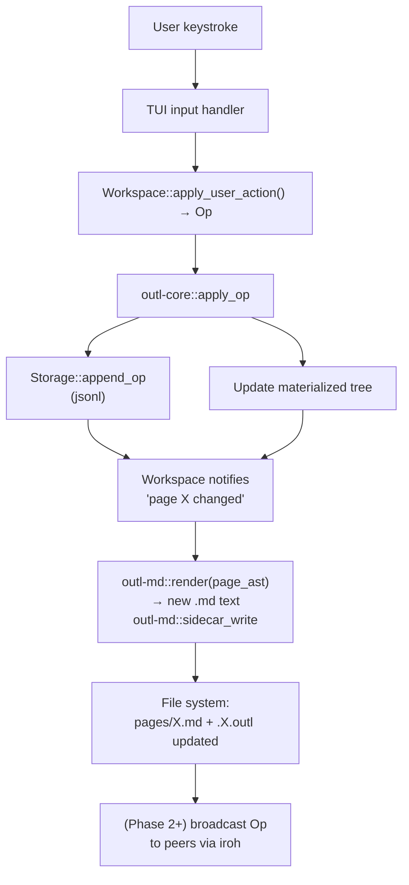
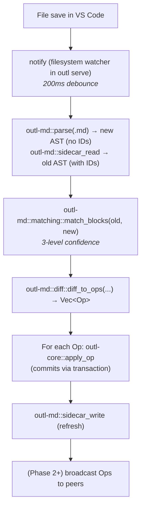

# Architecture

High-level structure and the major design decisions behind it.

## Overview

outl is split into six crates today:



`outl-core` knows nothing about files, markdown, or networks.
`outl-md` knows about markdown and sidecars but nothing about a workspace mutation pipeline.
`outl-actions` is the **only** crate where workspace-changing logic lives; every client routes through it so TUI and mobile cannot diverge on what "indent" or "toggle TODO" means.
`outl-cli`, `outl-tui`, and `outl-mobile` are I/O shells (key handling, Tauri commands, frontend wiring).

This split is what makes cross-device sync possible — both clients operate on the same op log, through the same operations, with the same matching algorithm.

---

## Major design decisions

These were locked in before code shipped.
Don't unilaterally pivot — ask first.

### 1. Markdown is source of truth

The user's words live in `.md` files.
The op log is **derived** from user-facing operations.
If we lose the op log, we can reconstruct the current state from `.md` + sidecar.

**Trade-off:** the file system is the canonical interface.
We accept the overhead of writing `.md` after every op.
The alternative (DB-only) is what Logseq moved to and what broke their community.

### 2. Op log on disk: JSONL per actor

Each device appends to a single `ops/ops-<actor>.jsonl` file inside the workspace. iCloud Drive (and any other file-level sync transport) syncs each actor's jsonl independently, so two devices never collide at the filesystem layer — the CRDT merges the per-actor streams after reading them.
This is the **only** persistent backend; 0.5.0 removed the older SQLite backend after it kept producing divergent op logs between clients on the same workspace.

**Trade-off:** JSONL is easy to inspect, easy to ship across any file-level transport, and trivial to reason about.
We give up SQL queries (we don't need them — replay + in-memory index is fast enough) and PRAGMA-level integrity guarantees (replaced by partial-write tolerance: a half-written tail line is just skipped).
`Storage` is still a trait — `ChronDbStorage` (issue #1) can land later without touching `outl-core` logic.

### 3. `Storage` is a trait, not a concrete struct

```rust
trait Storage: Send + Sync {
    fn append_op(&mut self, op: &LogOp) -> Result<()>;
    fn ops_since(&self, ts: HLC) -> Result<Vec<LogOp>>;
    // ...
}
```

`outl-core` consumes `dyn Storage`.
`JsonlStorage` (in `storage/jsonl.rs`) is the only persistent impl; `MemoryStorage` (in `storage/memory.rs`) is the test double.

**Why:** swapping backends is a single-file change.
Test doubles are trivial.
Phase 2's sync code can mock storage.
Future ChronDB integration is a PR adding `storage/chrondb.rs`.

### 4. Sidecar JSON instead of inline IDs

Logseq writes `id:: 01HXY...` lines into the `.md`.
We refused that.

We write the IDs into a sidecar file `foo.outl` (JSON next to `foo.md`).
The `.md` stays clean.
VS Code shows what the user wrote.
GitHub renders it beautifully.
Obsidian doesn't get confused.
The sidecar lives in the same directory so iCloud Drive ships it alongside the `.md` — the dotfile form was abandoned because iCloud Documents skips dotted paths when syncing across devices.

**Trade-off:** external edits require **matching** to reconstruct IDs.
That's a real algorithm (`outl-md/src/matching.rs`) with three confidence levels and an orphan log.
It's more work than inline IDs, but the user experience is dramatically better.

### 5. Tree CRDT specifically, not a generic CRDT

We could use a generic op-based CRDT (Automerge).
We chose to implement Kleppmann 2022 directly because:

- The paper is short and the algorithm fits in ~300 lines of Rust.
- Domain-specific = better error messages, simpler API.
- We control the on-disk format (op log schema).
- No transitive deps on a heavyweight CRDT framework.

**Trade-off:** we're on the hook for correctness.
That's why the test battery is huge and the coverage target on the four critical functions is 100%.

### 6. Yrs for block text content

Tree CRDT moves blocks.
Yrs (Yjs in Rust) handles concurrent edits to the text **inside** a block.
Combining them gives us:

- Block-level structure: tree CRDT.
- Character-level text: Yrs.

Yrs is mature, battle-tested in Yjs-based apps.
Reusing it lets us focus on the part nobody else has solved (the tree).

### 7. ULID for IDs

128 bits, lexicographically sortable, monotonic per millisecond, no central authority.
Better than UUIDv4 (random, sorting nightmare) and better than UUIDv7 (good but ULID is established and the spec is finalized).

### 8. uhlc for timestamps

Hybrid Logical Clock = wall clock + logical counter + actor.
Comparing two HLCs gives a total order without coordination, and the wall-clock component keeps timestamps human-meaningful for debugging.

### 9. Journal is a first-class concept

Daily notes (`2026-05-24.md`) live in `<workspace>/journals/`, separate from `<workspace>/pages/`.
Navigation keys `[`, `]`, `t` are dedicated to journals.
When you open `outl-tui`, you land on today's journal.

This isn't an afterthought — it's the primary input path for the user's day-to-day notes.
Anything that makes journal access slow or hidden is wrong.

### 10. MIT license

One license, no dual-license boilerplate to maintain, no patent grant language to argue about.
Permissive enough for any downstream — including plugin authors who want to relicense their own crates differently.

### 11. iroh for P2P (phase 2)

QUIC, hole punching, no central servers, no STUN/TURN dependency in the common case, in Rust, BSD-licensed.
The alternatives are heavier (libp2p) or non-Rust.

### 12. Tauri for desktop (phase 5)

Rust core reuse, smaller binary than Electron, native webview.
Slightly worse UX consistency than fully-native, but acceptable for an outliner where the bulk of the UX is text and lists.

### 13. Tauri 2 for mobile (replaces the earlier uniffi plan)

Originally planned around `uniffi` with SwiftUI / Compose native UIs.
The plan changed when the mobile client landed: Tauri 2 ships a single Rust binary that hosts a `WKWebView` running a SolidJS + Tailwind frontend, with native bits (`NSMetadataQuery`, accessory toolbar, ref suggester) written in Objective-C alongside the Tauri shell in `gen/apple/Sources/outl-mobile/main.mm`.
Trade-offs:

- **Win:** the entire workspace operation surface is shared with the TUI via `outl-actions`.
  Zero duplicated business logic.
  Adding a feature on one client means adding it on the other for free.
- **Win:** Solid + Tailwind iterates fast and we control the rendering pipeline end-to-end.
- **Loss vs. uniffi:** the UI is webview-hosted, not native widgets.
  Acceptable for an outliner where the bulk of the UX is text and bullets; would be a worse trade for a graphics-heavy app.

Android lands on the same Tauri 2 surface when it's prioritised; only the `main.mm`-equivalent layer (iCloud watcher) needs an Android counterpart.

---

## Data flow

### User types in TUI (write path)



### User edits .md in VS Code (read-from-disk path)



---

## Concurrency model

Two layers:

**Within one device.** `outl-tui` and `outl-mobile` each hold a single `Workspace` behind a `Mutex` (or its parking_lot equivalent).
All mutations route through `outl_actions::*` functions that take `&mut Workspace` and append to the actor's `ops-<actor>.jsonl` via `Workspace::apply`.
The TUI's optional file watcher and the mobile's Tauri command surface are the two writers; they serialise on the workspace lock.

**Across devices.** Each device only ever writes to its own `ops-<actor>.jsonl`.
The transport (iCloud Drive today, iroh in phase 2) is responsible for shipping each actor's file to every other device.
`outl_actions::SyncEngine` is the shared piece that both the TUI poller and the mobile `NSMetadataQuery` watcher call when a peer file changes:

- `snapshot_peers()` lists every `ops-*.jsonl` *except this device's* so a client never reacts to its own writes (the destructive save-reload-race loop is closed at this filter).
- `reload_workspace()` reopens the workspace from disk, merging all per-actor jsonls by HLC and replaying through the move-op algorithm.
- `reproject_page(workspace, page_id)` re-emits the focused page's `.md` + sidecar from the new tree state.
- `scan_for_orphans()` finds `.md` files whose sidecar is missing or whose `last_synced_hash` no longer matches — fresh imports (Roam/Logseq dump, peer-shipped projection without sidecar) or external edits in vim.
  Both paths feed `outl_md::reconcile::reconcile_md`.

The TUI poller checks peer snapshots every ~2s on a worker thread.
Mobile registers `NSMetadataQuery` on the iCloud ubiquity container.
Both call into the same `SyncEngine`.
Insert mode in the TUI defers the reload via a `pending_reload` flag drained on commit — see [`crates/outl-tui/CLAUDE.md`](../crates/outl-tui/CLAUDE.md#peer-sync-coordination) for the policy.

---

## Error handling philosophy

- `thiserror` for typed errors in libs.
- `anyhow` only at the binary boundary (CLI prints errors with context).
- No `unwrap()` in non-test code.
- A corrupt sidecar is **recoverable**: `outl doctor` regenerates it from the op log.
  Don't crash, log + fall back.
- A corrupt op log is **catastrophic** but we surface it loudly via `outl doctor` so the user can intervene before further writes.

---

## Future considerations (documented, not built)

- **End-to-end encryption** of sync traffic — iroh supports it, we'll enable.
- **Per-workspace identity** — each device gets a stable ActorId stored in `.outl/config.toml`.
- **Read-only export** — Hugo, static HTML, PDF.
- **Plugin system** — `rhai` scripts that consume op stream, expose new query types, render hooks for TUI.
  Phase 4.
