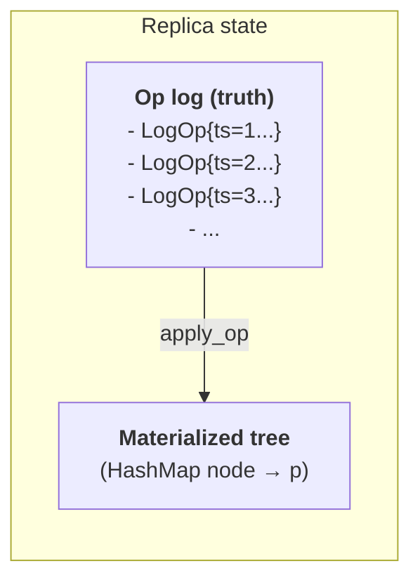

# Tree CRDT walkthrough

This is the deep-dive companion to [Sync, done right](sync.md). The
sync page argues *why*; this one walks through *how*, with code.

It specifies the tree CRDT used by `outl-core`: an op log of `Move` /
`Edit` / `SetProp` / `Create` operations is replicated and converged
across devices without coordination, without a server, and without
ever corrupting the user's outline.

The algorithm is from:

> **Martin Kleppmann, Dominic P. Mulligan, Victor B. F. Gomes, Alastair R.
> Beresford.** *"A highly-available move operation for replicated trees."*
> IEEE Transactions on Parallel and Distributed Systems, 2022.
> <https://martin.kleppmann.com/papers/move-op.pdf>

Block-level text editing rides on **Yjs/Yrs**, which is itself a CRDT and
needs no orchestration beyond delivering its binary updates to the right node.

---

## Why a tree CRDT is necessary

A naive replicated outline breaks in three ways:

1. **Text-level CRDTs (RGA, LSEQ, Y) don't model parent-child.** Edit the
   word "draft" inside a block: fine. Move the block to a different parent:
   the text CRDT has no opinion. Two devices doing concurrent moves can end
   up with the block having two parents, or zero parents, or in a cycle.

2. **List CRDTs (`Y.Array`, RGA) don't handle reparenting.** They give you
   convergence within a list, but the user's outline isn't one list — it's
   nested lists.

3. **Git merge destroys outline structure.** Concurrent edits to the same
   line collide. The user does a manual merge and the IDs are gone, the
   structure is mangled, or both. We don't ship that to users.

A tree CRDT specifically tracks the **parent of each node** as part of the
replicated state. Concurrent moves of the same node converge by op ordering.
Concurrent moves that would create a cycle are detected and the loser
becomes a no-op deterministically.

---

## State model

Each replica holds two things:

1. **Op log** — append-only, totally ordered by HLC `(timestamp, actor)`.
2. **Materialized tree** — derived from the log via `apply_op`.



The tree is **derivable** from the log. It exists for fast reads but is
never authoritative. A corrupted tree is rebuilt by replaying the log.

---

## Op types

```rust
enum Op {
    Move {
        node: NodeId,
        new_parent: NodeId,
        position: Fractional,
        // Populated by do_op; needed for undo.
        old_parent: NodeId,
        old_position: Fractional,
    },
    Edit {
        node: NodeId,
        text_op: YrsUpdate,  // binary delta from Yrs
    },
    SetProp {
        node: NodeId,
        key: String,
        value: Option<PropValue>,  // None = remove
        old_value: Option<PropValue>,
    },
    Create {
        node: NodeId,
        parent: NodeId,
        position: Fractional,
    },
    SetCollapsed {
        node: NodeId,
        value: bool,
        // Populated by do_op; needed for undo.
        old_value: bool,
    },
}

struct LogOp {
    ts: HLC,
    actor: ActorId,
    op: Op,
}
```

The `old_*` fields are **not** filled in by the producer. They are populated
by `do_op` at the moment the op is applied, so `undo_op` can later revert
exactly to the pre-op state.

**`Delete` is intentionally not an op.** Deleting node `N` is `Move(N, TRASH_ROOT)`.
This simplifies the algorithm — concurrent edit + delete becomes concurrent
edit + move — and preserves the deleted subtree for history/undo.

**`SetCollapsed` carries UI fold state through the op log.** The flag controls
whether a block renders with its children hidden in the outline view —
presentation state, but globally meaningful across devices. Routing it
through an `Op` (rather than a sidecar field) is what gives concurrent
flips a real merge semantics: each device appends to its own
`ops-<actor>.jsonl`, HLC + actor tiebreak resolves any timing collision
deterministically, and idempotent re-apply of the same `LogOp` is a no-op.
This is the canonical pattern for any future per-block UI state that
must converge — pin status, custom colour, whatever. The sidecar carries
only structural matching metadata; sync state belongs on the op log.

---

## HLC timestamps

We use **Hybrid Logical Clocks** via the `uhlc` crate.

```
HLC = (physical_ms: u64, logical_counter: u32, actor: ActorId)
```

Comparison is lexicographic: physical first, then logical, then actor as
final tiebreak. This gives a **total order** without coordination.

**Why actor is tiebreak, not random**: when two replicas pick the same
`(physical, logical)` (clock skew, very busy moment), the actor ID — a ULID
fixed per device — breaks the tie deterministically. Both replicas agree on
the same winner without talking to each other.

---

## Fractional indexing

Sibling order uses a **fractional index** — a lexicographically sortable
string position.

```
inserting between "a1" and "a2" → "a1V"
inserting between "a1V" and "a2" → "a1k"
inserting at the start → ""+key < "a1"
```

`Move` only changes the position of the moved node. Siblings keep their
fractional indices unchanged. Concurrent inserts at the same gap resolve by
HLC tiebreak: both succeed, the one with the higher HLC sorts after.

Implementation: ~100 lines, or use the `fractional_index` crate.

---

## `do_op`

```
do_op(op):
    match op:
        Move { node, new_parent, position, old_parent, old_position }:
            // 1. Capture pre-state on the LogOp for undo.
            log_op.op.old_parent   = tree.parent(node)
            log_op.op.old_position = tree.position(node)

            // 2. Check for cycle (NB: ancestor check is transitive).
            if creates_cycle(node, new_parent):
                // NO-OP on tree. LogOp still gets appended.
                return

            // 3. Apply.
            tree.set_parent(node, new_parent, position)

        Edit { node, text_op }:
            if tree.contains(node):
                tree.block_content_mut(node).apply_yrs_update(text_op)
            // If the node is in TRASH_ROOT, the edit applies to the Yrs doc
            // but the user won't see it. That's fine — semantics preserved.

        SetProp { node, key, value, old_value }:
            log_op.op.old_value = tree.property(node, key)
            tree.set_property(node, key, value)

        Create { node, parent, position }:
            // Idempotent: if node already in tree, no-op.
            if !tree.contains(node):
                tree.create(node, parent, position)
```

The materializing effect of `do_op` is **observable**. The `LogOp` mutation
(filling in `old_*`) is bookkeeping that makes `undo_op` possible.

### `creates_cycle`

```
creates_cycle(node, new_parent):
    if new_parent == node:
        return true
    // Walk up from new_parent toward root; if we hit `node`, it's a cycle.
    p = new_parent
    while p is not ROOT and p is not TRASH_ROOT:
        if p == node:
            return true
        p = tree.parent(p)
    return false
```

The naive check `tree.parent(node) == new_parent` is **wrong**. A correct
check is transitive. Failing this gives you the bug from `cycle_chain.rs`.

---

## `undo_op`

```
undo_op(log_op):
    match log_op.op:
        Move { node, old_parent, old_position, ... }:
            // Note: undo a cycle-no-op move is also a no-op (tree wasn't changed).
            // We detect that by checking if current parent matches the move's
            // new_parent — if it doesn't, the move was a no-op, skip undo.
            if tree.parent(node) == log_op.op.new_parent:
                tree.set_parent(node, old_parent, old_position)

        Edit { node, text_op }:
            // Yrs supports applying an inverse update. We store the original
            // state ref ID and undo via Yrs's undo manager if available, or
            // skip — Yrs already converges, so undo here is partial.
            // (See Yrs section below.)

        SetProp { node, key, old_value, .. }:
            tree.set_property(node, key, old_value)

        Create { node, .. }:
            tree.remove(node)
```

Undo precondition: the op was previously applied via `do_op`. Calling
`undo_op` on something that was never `do_op`'d is undefined — but
`apply_op` is responsible for only undoing things that were applied.

---

## `apply_op`

```
apply_op(new_op):
    if log.empty() or new_op.ts > log.last().ts:
        do_op(new_op)
        log.append(new_op)
    else:
        // Reorder: pop newer ops from the log, undo each, then redo in order.
        undone = []
        while not log.empty() and log.last().ts > new_op.ts:
            op = log.pop()
            undo_op(op)
            undone.push(op)

        do_op(new_op)
        log.append(new_op)

        // Replay undone ops in their original order.
        for op in undone.reverse():
            do_op(op)
            log.append(op)
```

Idempotency check is implicit: if `new_op.ts` already exists in the log with
the same actor, the function is a no-op (or we check explicitly to skip).
Implementation note: keeping the log sorted by `(ts, actor)` makes the lookup
`O(log n)` via binary search.

---

## The cycle case (worked example)

The textbook concurrent-move conflict:

**Initial state**:
```
ROOT
├── X
│   └── A
└── Y
    └── B
```

**Device 1** (online, time t=10): `Move(A, B)`.

After applying:
```
ROOT
├── X (empty)
└── Y
    └── B
        └── A
```

**Device 2** (offline, time t=12): `Move(B, A)`.

After applying locally:
```
ROOT
├── X
│   └── A
│       └── B
└── Y (empty)
```

Now devices reconnect.

**Device 1 receives** `Move(B, A)` with ts=12:
- ts=12 > last ts in log (ts=10). Append.
- `do_op(Move(B, A))`:
  - `creates_cycle(B, A)`? Walk up from A: A → B → ROOT. Hit B. **Yes, cycle.**
  - No-op on the tree. But `LogOp` still appended.
- Device 1 final tree: same as before.

**Device 2 receives** `Move(A, B)` with ts=10:
- ts=10 < last ts (ts=12). Reorder!
- Pop `Move(B, A)` from log, `undo_op` → tree reverts to initial.
- `do_op(Move(A, B))`:
  - `creates_cycle(A, B)`? Walk up from B: B → Y → ROOT. No cycle.
  - Apply. Tree: A is child of B, X is empty.
- Push `Move(A, B)` to log.
- Replay undone: `do_op(Move(B, A))`:
  - `creates_cycle(B, A)`? Walk up from A: A → B → Y → ROOT. Hit B. **Yes, cycle.**
  - No-op on the tree.
- Device 2 final tree:
```
ROOT
├── X (empty)
└── Y
    └── B
        └── A
```

**Both devices converged to the same tree.** And `Move(B, A)` is still in
the log on both devices, ready to become non-cyclic if some future op
re-arranges B and A.

---

## Yrs integration (block content)

A block's textual content is a Yrs `TextRef` inside a per-block `Doc`.
Edits to a block produce binary update bytes via `Doc::encode_state_as_update_v1`.

When a `Edit` op arrives:

1. Decode the binary update.
2. Find the block's `Doc` (creating one if it doesn't exist — content of a
   never-seen block is replayed from the update).
3. `Doc::apply_update(update)`.

Yrs is itself a CRDT, so block content convergence is guaranteed by Yrs.
Our job is just to deliver the right update to the right node.

**Note on undo for `Edit`**: Yrs has an `UndoManager`, but its semantics
don't perfectly align with our tree-level undo. For phase 1 we accept that
undoing an `Edit` may be partial (the materialized text on undo may include
parts of the edit that interleave with concurrent edits). This is **safe**
— Yrs guarantees convergence — but it's worth documenting that
user-facing "undo" in the TUI cannot rely on `undo_op` for text.

---

## The five formal invariants

The algorithm in this document is meant to satisfy:

### 1. Convergence (Strong Eventual Consistency)

For any two replicas R₁, R₂ that have observed the same set of ops S:
```
materialized_tree(R₁) == materialized_tree(R₂)
```

Test: `tests/convergence.rs` — three replicas apply ops in different
permutations, all materialize the same tree.

### 2. Commutativity after reordering

`apply_op` is **commutative** in the sense that the final state depends
only on the set of ops, not the order they were delivered. Reordering is
handled internally via undo/replay.

Test: `tests/property_based.rs` with proptest.

### 3. Idempotency

```
apply_op(op); apply_op(op) ≡ apply_op(op)
```

Test: `tests/idempotency.rs`.

### 4. Tree invariant preservation

After any number of `apply_op` calls, the materialized tree is a valid
tree:

- No node has two parents.
- No cycle exists.
- Every node is reachable from `ROOT` or `TRASH_ROOT`.

Test: `tests/cycle.rs`, `tests/cycle_chain.rs`, plus invariant assertion in
property tests.

### 5. No silent loss

Every op delivered to `apply_op` ends up in `log` (modulo idempotent dedup).
This includes:

- Ops that are no-ops on the materialized tree (cycle detection)
- Ops that arrived out of order (always appended after reorder)
- Ops on nodes in `TRASH_ROOT` (still recorded)

Test: assertions in every CRDT test that `log.len()` grows monotonically
with applied unique ops.

---

## Test battery

Mandatory tests in `crates/outl-core/tests/`:

| File | Tests |
|------|-------|
| `convergence.rs` | 3 replicas, 100+ random ops in different orders → same final state |
| `cycle.rs` | A↔B classic case |
| `cycle_chain.rs` | A→B→C with concurrent C→A; transitive ancestor check |
| `concurrent_edit_move.rs` | Block edited and moved simultaneously |
| `concurrent_delete_edit.rs` | Move-to-trash wins, edit recorded |
| `late_op.rs` | Op with old ts forces reorder |
| `idempotency.rs` | apply N times == apply 1 time |
| `fractional_index.rs` | Concurrent inserts at same gap converge |
| `large_log.rs` | 10k ops stress, asserts < 1s materialization |
| `property_based.rs` | proptest, generates random op sequences |

Coverage target:

- **`tree::do_op`, `tree::undo_op`, `tree::apply_op`, `tree::creates_cycle`: 100%**
- **`outl-core` overall: > 90%**

---

## What this algorithm does NOT solve

Be honest about the limits:

- **No fine-grained block-level merge of moves.** If both replicas move the
  same node concurrently, one move wins (by HLC). The losing replica's user
  may briefly see a different position, but after sync everyone agrees.
  This is *the right thing* — pretending both moves "succeed" loses information.

- **No application-level conflict notification.** outl converges silently.
  A future feature could surface "concurrent edits to this block" in the UI.
  Not in phase 1.

- **No causal delivery enforcement.** We rely on HLC ordering, not vector
  clocks. The algorithm is correct under any delivery order (that's the
  point of `apply_op` doing undo/replay), but it's worth noting we don't
  need causal channels.

- **Yrs `Edit` undo is best-effort.** As noted above, undoing a text edit
  via `undo_op` may not reverse the user-visible string exactly when there
  are interleaved concurrent edits. The string state still converges; only
  undo semantics weaken.

---

## References

- Paper: <https://martin.kleppmann.com/papers/move-op.pdf>
- OCaml reference impl: <https://github.com/martinkl/crdt-tree-move>
- Kleppmann's talk: "CRDTs: The Hard Parts" (Strange Loop 2020)
- Yrs: <https://github.com/y-crdt/y-crdt>
- Yjs docs: <https://docs.yjs.dev/>
- Author write-ups on the outl implementation:
  - [From paper to outliner](https://avelino.run/from-paper-to-outliner/)
    — the gap between the paper's convergence proof and a shipped
    app (projections, reconciliation, transport edge cases).
  - [File sync isn't trivial](https://avelino.run/file-sync-isnt-trivial/)
    — why concurrent file moves are a distributed-systems problem,
    framed for engineers who haven't read the paper yet.
