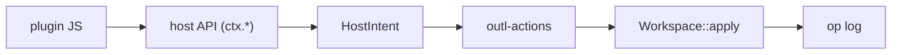
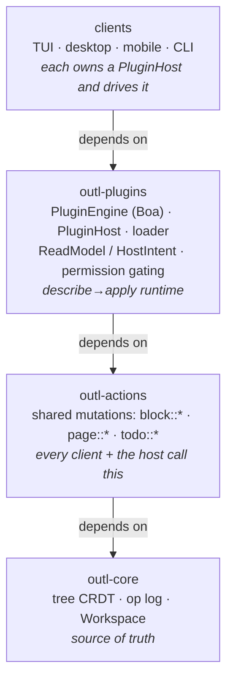
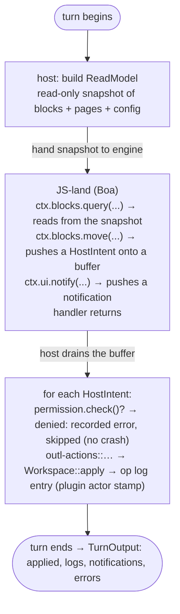

# Plugin architecture

This is the **internals** map of the plugin system: how a plugin runs, why it can't corrupt your workspace, and where the seams are.
If you want to *install and use* plugins, read [Plugins](plugins.md); if you want to *write* one, read [Plugin API](plugin-api.md) and the [Plugin tutorial](plugin-tutorial.md).

The whole design answers one question: **how do you let untrusted JavaScript mutate a CRDT-backed workspace without ever handing it `&mut Workspace`, and have the result converge across devices?**
The answer is a describe → apply loop on top of the op log.

---

## The one rule everything else follows

A plugin never touches `outl-core`, never holds a mutable workspace, and never edits a `.md` file.
Every mutation it asks for travels the same path:

The op log stays the source of truth (root invariant 1), the markdown stays 100% clean (root invariant 2), and every op a plugin produces is stamped `actor = "plugin:<id>@<device>"` so the log doubles as a per-plugin audit trail.
A plugin is, structurally, a thing that **reads a snapshot and proposes ops** — nothing more.

---

## Layers

Each layer below only depends on the ones above it.
Plugins sit at the bottom and reach the tree only through the layers in between — never directly.

A plugin's reach is `JS → ctx.* → HostIntent → outl-actions → Workspace::apply`.
It does **not** include `outl-core` directly, the `.md` files, or the sidecar.

`outl-plugins` is the single owner of the runtime; every client wraps it the same way.
The host-API methods are thin wrappers over `outl-actions` — the crate re-implements no block or page logic of its own.

---

## Execution model: describe → apply

This is the heart of the system, and the reason it runs unchanged on iOS (Boa is pure-Rust, no JIT).

The JS engine **never holds `&mut Workspace`.**
A "turn" is one unit of plugin work — running a command, or dispatching one applied op to an `onOp` hook — and it has three phases:

1. **Describe.**
   Before invoking the plugin, the host computes a read-only `ReadModel`: every block (`{id, text, todo?, page}`) and every page (`{slug, title, kind}`) in the workspace, plus the plugin's config.
   It hands that snapshot to the engine.
2. **Run.**
   The plugin's handler runs in JS-land.
   It *reads* from the snapshot (`ctx.blocks.query`, `ctx.page.list`, `ctx.config.get`) and *emits* `HostIntent`s into a buffer (`ctx.blocks.edit`, `ctx.blocks.move`, …).
   It cannot mutate anything itself; an "edit" is just a description of an edit pushed onto the buffer.
3. **Apply.**
   When the handler returns, the host **drains the buffer** and applies each intent through `outl-actions` → `Workspace::apply` → the op log — one at a time, each gated on the plugin's approved permissions.

Plugin handlers live in JS-land on `globalThis.__OUTL` (the `commands` map and the `opHooks` list).
The Rust side never stores a `JsFunction`; it only calls dispatch entry points (`__outl_dispatchCommand`, `__outl_dispatchOp`) by id.
That's what keeps the Boa `Context` self-contained and the seam clean.

### The consequence you must internalize

**Reads are a snapshot taken at the start of the turn.**
A mutation a plugin emits is *not* visible to a `query` later in the same turn — the intent hasn't been applied yet; it's still sitting in the buffer.
If your plugin needs to act on the result of its own write, that happens on a *later* turn (e.g. the `onOp` hook fired by the applied op), not within the current one.

This is a deliberate trade: it's what lets the engine stay ignorant of the workspace and stay `!Send`-friendly, and it's why a plugin can never observe a half-applied tree.

---

## Anti-loop: `last_seen`

Op hooks are the obvious place to create an infinite loop: an `onOp` handler that reacts to an op by emitting an op would re-trigger itself forever.
The host kills that with a high-water mark.

`PluginHost` tracks `last_seen` — how far into the op log it has already dispatched.
`sync_hooks` is the single entry point a client calls after any action.
It projects the ops appended *since* `last_seen`, dispatches each to the `onOp` hooks, applies whatever they emit, and then advances `last_seen` **past the plugin's own ops too.**
Because the plugin's writes are already behind the mark, they never re-enter the hook dispatch.
There is no plugin → op → plugin cycle.

A `dispatching` re-entrancy flag adds a second guard, and `mark_synced` lets a client catch the host up to the current log at startup so pre-existing ops don't fire hooks on boot.

### Gas: a runaway plugin can't wedge the engine

The op-log mark stops a plugin from looping *through the host*; `RuntimeLimits` stops it from looping *inside JS*.
Boa runs with a loop-iteration cap (~20M), a recursion cap (~2000), and a stack-depth cap.
An infinite loop or unbounded recursion surfaces as a JS error on that turn, not a hung thread.
It's cooperative gas against a misbehaving plugin, not a wall-clock timeout.

---

## Threading: `PluginHost` is `!Send`

Boa's `Context` is single-threaded, so `PluginHost` is **not `Send`**.
That's fine for the TUI and CLI — they're single-threaded around the workspace and drive the host inline.

GUI clients can't do that: Tauri's app state must be `Send + Sync`.
So desktop and mobile run the host on a **dedicated plugin thread** that owns it for the process lifetime.
The thread holds a clone of the same `Arc<Mutex<…Workspace>>` every Tauri command already locks (the `Workspace` itself *is* `Send`).
Tauri commands talk to the thread over an `mpsc` channel and block on a one-shot reply; the Boa `Context` never crosses a thread boundary.

The contract is uniform: every client constructs a `PluginHost` with its own `ClientCapabilities`, loads installed plugins into it, and calls `run_command` / `sync_hooks`.
Only the *plumbing* (inline vs. dedicated thread) differs.

---

## Extension points: capabilities

A **capability** is something a plugin plugs into; a **client** implements a subset.
At load the loader **intersects** the two ([`capability::intersect`]): capabilities both declared and implemented are *granted*.
Capabilities the plugin declared but the client can't honor land in *missing* and surface as a warning — the plugin still loads for everything else, never a crash.

The canonical capability list and per-client support table is owned by [Plugins → Capabilities per client](plugins.md#capabilities-per-client).
The architectural summary of what each one *means* and its implementation status:

| Capability | What it does | Status |
|---|---|---|
| `op-hook` | `ctx.ops.onOp(cb)` fires for every applied op (local or from sync). | **Works** — TUI, desktop, mobile, CLI. |
| `slash-command` | `ctx.commands.register(id, handler)`; the host lists it via `commands()` for the client's palette / slash menu. | **Works** — TUI slash menu, desktop palette, mobile sheet, CLI `plugin run`. |
| `config-schema` | The plugin reads its config via `ctx.config.get()`; the value comes from the lockfile's `config` field. | **Partial** — reading config works; a config-editing form UI does not exist yet. |
| `keybinding` | Declarable in the manifest (`contributes.keybindings`), validated against contributed commands, parsed into an `outl_shortcuts::ChordSequence`. | **Works** — TUI (chord from Normal mode, single + two-chord, never overriding a native binding) and desktop (a native binding always wins). Mobile has no keyboard. |
| `toolbar-button` | Contribute a button for the plugin's command. | **Works** — desktop and mobile render a chrome button; the TUI surfaces the command in its slash menu (no chrome bar in a terminal). Not applicable to the CLI. |
| `content-transformer:text` | Render a fenced block as text / markdown (`ctx.content.register`). | **Works** — TUI (inline), desktop, mobile. The CLI has no read surface. |
| `content-transformer:rich` | Render a fenced block as HTML in a sandboxed iframe inline in the block. | **Works on the GUIs** — desktop and mobile. The TUI/CLI drop a `rich` descriptor. |
| `sync-transport` | Provide a sync transport via `ctx.sync.register({ push, pull })`. | **Core ready** — the host serializes/applies ops through the transport and convergence is tested; **no client polls it on a timer yet** (roadmap). |

A query engine is **not** a separate capability: a plugin that wants to answer query blocks registers a `content-transformer` for the `query` fence language.
Inline `{{query}}` would need a new markdown token the parser defers.

### How a mutation flows, end to end

Following one `ctx.blocks.move(id, { toPage: "archive" })` all the way down:

1. **JS:** the SDK turns the call into `__outl_emit(JSON.stringify({ op: 'move', node: id, target: { toPage: 'archive' } }))`, pushing a `HostIntent::Move` onto the turn's buffer.
   It returns immediately — nothing has changed yet.
2. **Host, on drain:** it checks the plugin holds `write-page`.
   Denied → recorded as a `PluginRun` error and skipped; granted → continue.
3. **Apply:** the host resolves the target.
   `toPage` runs `page::open_or_create("archive")` (idempotent), then `block::move_under(node, page)`.
4. **outl-actions → core:** the action calls `Workspace::apply`, which appends a `Move` op to the log, stamped with the plugin's actor, and re-materializes the tree (a move that would cycle is a log-only no-op per root invariant 4).
5. **Projection:** the `.md` re-renders from the tree on the next save.
   The plugin never saw a file path.

---

## Permission gating

Permissions are the security boundary; capabilities are the feature boundary.
A plugin declares the permissions it needs in its manifest, the user approves them on install, and the approved set is **frozen in the lockfile**.

Every host call that mutates is gated: `apply_intents` calls `permission.check(intent.required_permission())` before applying each intent.
A denied permission is **not a crash** — the intent is dropped and an error string is recorded on the `PluginRun`, which the client surfaces.
The plugin keeps running.

The permission wire strings and what each grants is owned by [Plugins → Permissions](plugins.md#permissions).
The gating-specific rules:

- **Network is never wide-open** — `network:*` is rejected at parse time.
  Only an exact host (`network:api.openai.com`) or a leading-label wildcard (`network:*.openai.com`) is valid, and the wildcard matches subdomains only — not the apex, not a suffix-collision like `evil-openai.com`.
- **Updates can't silently escalate** — `PermissionSet::covers` detects when a new version asks for more than was approved, so an update that wants a new permission re-prompts instead of arming itself.
- **Deny by default** — a permission you didn't request is a permission your code can't use, no matter what the JS tries.

> `ctx.storage` (`storage:local`) and `ctx.net` (`network:<domain>`) are **live and gated**.
> `ctx.storage` is per-plugin KV at `<workspace>/.outl/plugins/<id>/storage.json`, local-only and outside the op log (it never converges); calling it without the permission throws a clear error.
> `ctx.net.fetch` is **blocking** on the plugin thread (it blocks the TUI for the request's duration, bounded by `timeoutMs`) and **returns** `{ ok: false, error }` for a denied domain rather than throwing.
> `ctx.sync.register` is live too, but no client polls the transport on a timer yet (roadmap).
> See [Plugin API → Host API](plugin-api.md#host-api--plugincontext).

---

## Lifecycle: install → load → hash → intersect → run

### Install

`outl plugin install <local-dir>` (the `github:` source is roadmap; clone and pass the path):

1. Parse and validate `plugin.json` (id shape, semver ranges, keybindings reference real commands).
2. Copy the **installed shape** — `plugin.json`, the bundle, and the config schema if present — into `<workspace>/.outl/plugins/<id>/` (no `node_modules`, no source tree).
3. Compute the bundle hash (`sha256:<hex>` of `index.js`).
4. Show the requested permissions, get approval, and write an `installed.json` entry: version, source ref, `bundleHash`, `permissionsApproved`, `enabled`, `config`.

### Load (on boot)

`load_installed` reads `installed.json` and, for each **enabled** plugin:

1. **Hash check** — re-hash the on-disk bundle and compare to `bundleHash`.
   A mismatch (an out-of-band edit via Finder / iCloud / a half-finished sync) **blocks that plugin's load** (anti-tamper); it never silently runs modified code.
2. **Intersect** — match the manifest's capabilities against this client's `ClientCapabilities`; missing ones become warnings.
3. **Load + activate** — evaluate the bundle in a fresh Boa engine and run `activate(ctx)`, which registers the plugin's commands and hooks.

It's **best-effort**: a plugin with an invalid manifest, a hash mismatch, or a JS error lands in `LoadReport::failed` and is skipped — one broken plugin never takes down the others.

`_dev/<name>/` plugins load on a separate path: **no hash check** and **every declared permission implicitly granted** (dev mode), never recorded in the lockfile and excluded from sync.

### Run

- **Command:** `host.run_command(workspace, hlc, plugin_id, command_id)` runs one describe→apply turn and returns a `PluginRun { applied, logs, notifications, errors }`.
- **Hooks:** after any mutation, the client calls `host.sync_hooks(workspace, hlc)`, which dispatches the new ops to `onOp` and applies their intents — loop-safe via `last_seen`.

---

## Distribution

- **`registry.json`** (in `registry/`) is the day-zero "store": a static, versioned JSON index the clients read (over raw GitHub in production) to list and search installable plugins, with no server and no API.
- **`.outlpkg`** — the installed shape packed as tar+gzip for one-file distribution — is **roadmap**; today, install is from a local directory.

---

## Where the code lives

| Concern | File |
|---|---|
| Manifest parse + validation | `crates/outl-plugins/src/manifest.rs` |
| Capability enum + `intersect` | `crates/outl-plugins/src/capability.rs` |
| Permission enum + network rules + gating | `crates/outl-plugins/src/permission.rs` |
| Lockfile (`installed.json`) + bundle hash | `crates/outl-plugins/src/lockfile.rs` |
| JS↔host data (`ReadModel`, `HostIntent`, …) | `crates/outl-plugins/src/model.rs` |
| Engine seam (`PluginEngine` trait) | `crates/outl-plugins/src/runtime.rs` |
| Boa engine + JS prelude (the `ctx` object) | `crates/outl-plugins/src/engine.rs` |
| `PluginHost` (load, run, hooks, intent apply) | `crates/outl-plugins/src/host.rs` |
| Disk loader + `install_from_dir` | `crates/outl-plugins/src/loader.rs` |

The full crate context, invariants, and current status live in `crates/outl-plugins/CLAUDE.md`.

---

## See also

- [Plugins](plugins.md) — install, permissions, distribution, the lockfile (user guide).
- [Plugin API](plugin-api.md) — the manifest and host-API reference (the canonical API table lives there).
- [Plugin tutorial](plugin-tutorial.md) — build the TODO-archiver from scratch.
- [Architecture](architecture.md) — the workspace, op log, and CRDT this all sits on.
- [`plugin-v1.json`](schemas/plugin-v1.json) — the manifest JSON Schema.
