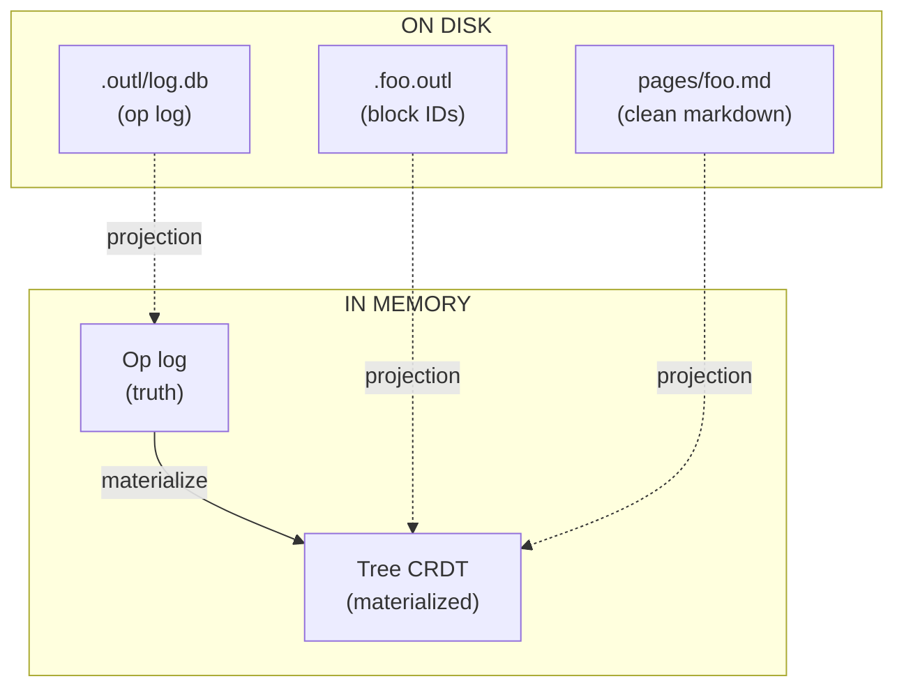
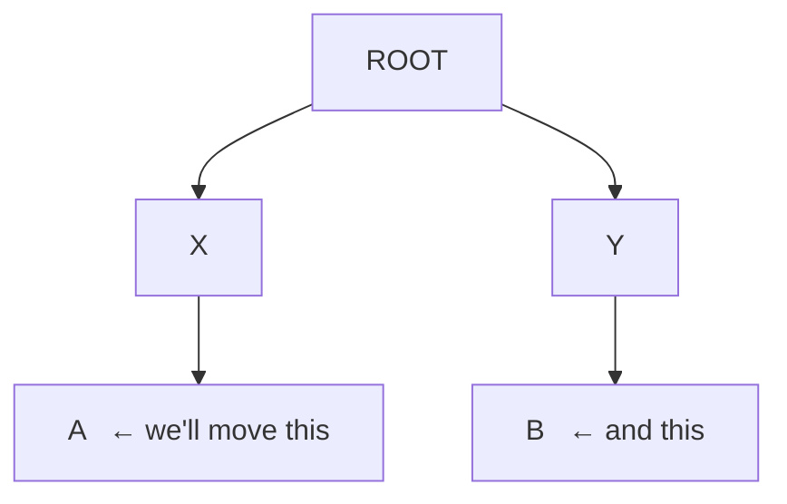
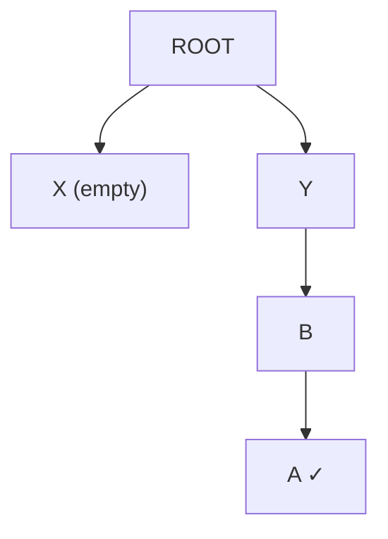
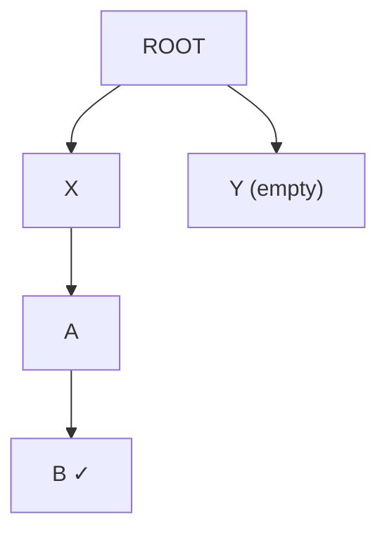

# Sync, done right

This page is the long version. The pitch in one sentence: **outl is
the only outliner whose sync is provably correct, doesn't need a
server, and doesn't pollute your markdown to do it.**

If you want the algorithm walked through with code, jump to the
[Tree CRDT walkthrough](crdt.md). This page is about *why* — what
breaks in the other tools, what we picked instead, and what the
trade-offs are.

---

## Where Roam and Logseq fail

Both got the outliner UX right. Both fall apart on sync.

### Roam Research — sync as a service

Roam keeps every workspace in a central database on their servers.
Real-time sync is great when it works. The cost:

- **Your data lives on their machines.** Export is JSON; the moment
  Roam decides to throttle, raise prices, or shut down, your notes
  are stranded.
- **No offline merge.** Two devices edit the same block while
  disconnected? The one that connects last wins, the other one's
  changes silently vanish. There's no conflict surfaced, no merge
  prompt, no history of what was lost.
- **No interop.** You can't open a Roam graph in another editor.
  There's no `.md` on disk to inspect.

Roam was an inspiration for what an outliner *feels* like. It is not
an example of how to store your thinking.

### Logseq — files on disk, but the merge is hopeful

Logseq fixed the "where do my files live" problem: it writes
markdown. Then it broke the markdown:

```markdown
- ## My block
  id:: 6601a2c1-4f31-4a45-1c2c-3a5e6b7d8f90
  - child block
    id:: 6601a2c1-...
```

Every block gets a UUID written *into the file*. Open it in
VS Code, Obsidian, or `cat`, and it's full of metadata. Worse:

- **Sync is a paid Pro tier.** And it's a file-rsync flavor — there
  is no merge algorithm. When two devices write the same file, the
  newer one wins. Same loss as Roam, just with extra steps.
- **DB version split the community.** Logseq's pivot to a database
  backend left the file-based users behind and shipped half-broken
  for over a year.
- **Mobile is a known-bad experience.** Years of users asking for
  parity.

Logseq pointed at the right idea — files on disk — and stopped
halfway.

### Plain Git — the merge destroys structure

If files are markdown and you want sync, why not just `git`?

```bash
git pull --rebase
# CONFLICT (content): Merge conflict in pages/Avelino.md
```

Git treats the file as a sequence of *lines*. When two people
re-arrange the outline, the lines line up wrong, the merge marker
splits a block in half, and you spend an hour resolving conflicts
by hand. Every move operation in a tree of nested bullets becomes
a textual war.

Try it once. You'll never do it twice.

---

## What outl does instead

The core idea is two layers:



1. **The op log is the source of truth.** Every change to the tree
   — moving a block, editing its text, setting a property,
   deleting — is recorded as a `LogOp` with a [Hybrid Logical Clock][hlc]
   timestamp. The list of ops, sorted by HLC, deterministically
   produces the tree.

2. **The materialized tree and the `.md` are projections.** Both can
   be thrown away. If your sidecar is lost, `outl doctor`
   regenerates it from the op log. If your `.md` is deleted, the op
   log still has every block.

3. **Markdown on disk is *clean*.** No `id::`, no HTML comments, no
   YAML frontmatter delimiters. Block IDs live in
   `.foo.outl` (a JSON dotfile). When you edit `pages/foo.md`
   externally, outl's [3-level matching algorithm][matching]
   reconstructs which block had which ID.

[hlc]: https://cse.buffalo.edu/tech-reports/2014-04.pdf
[matching]: markdown-format.md

The pieces that make this work:

| Piece | What it does |
|-------|--------------|
| **Tree CRDT** ([Kleppmann et al. 2022][paper]) | Every device applies ops in HLC order, undoes/replays late arrivals, and provably converges to the same tree. |
| **HLC timestamps** | Total order across devices without coordination. Wall clock + logical counter + actor ID. |
| **Yrs (Yjs in Rust)** | Character-level CRDT for the text *inside* a block. Concurrent edits to the same sentence merge cleanly. |
| **Fractional indexing** | Sibling order as a sortable string. Inserting between two positions doesn't renumber anyone. |
| **Slugified filenames** | `[[Avelino]]` resolves to `pages/avelino.md` with `title:: Avelino` set automatically. The display name stays human; the filename is stable. |

[paper]: https://martin.kleppmann.com/papers/move-op.pdf

---

## The hard case Roam and Logseq lose

Two devices, offline, both move the same block:

Initial state on both devices:



**Device 1** moves `A` to be a child of `B`:



**Device 2** moves `B` to be a child of `A`:



Both are sensible local edits. Now they sync.

- **Roam** has no story — last write wins by wall-clock time.
- **Logseq sync** rsyncs the files; one device's edit replaces the
  other's. Information lost.
- **Git merge** sees two changed `.md` files, gives you a conflict
  with `<<<<<<<` markers across nested bullets, and you spend the
  next hour repairing your outline.

**outl** does this:

1. Both devices receive both ops via P2P sync.
2. Each device sorts the two ops by HLC. The earlier one applies
   normally.
3. The later one would close a cycle (A under B, B under A — a
   loop). The algorithm detects this **as a deterministic no-op on
   the materialized tree**, but the op stays in the log.
4. Both devices end up with the same final tree — exactly one of the
   two moves applied. No data loss. No conflict to resolve manually.

The op that became a no-op isn't discarded: if a future op breaks the
loop (someone moves a third block out), the algorithm can replay
history and find that the no-op move is now valid. The system never
forgets what you intended.

This worked example is implemented as the `cycle.rs` test in
`outl-core`. Every change to the algorithm has to pass it.

---

## What "do it right" actually means

It's worth being specific. The algorithm in outl provides these
**five formal guarantees**:

### 1. Strong eventual consistency

Two devices that have observed the same set of ops produce *exactly*
the same tree, regardless of delivery order or duplication.

Tested via `convergence.rs`: three replicas apply 100+ ops in three
different permutations and the resulting trees are byte-identical.

### 2. Commutativity after reordering

The order in which a replica *receives* ops doesn't matter. Internally
the algorithm undoes newer ops, applies the late arrival in HLC
position, then replays the undone ones. The user-visible state is the
same as if everything had arrived in HLC order from the start.

### 3. Idempotency

Applying the same op N times is the same as applying it once. You can
re-sync a workspace that's already in sync and nothing changes.
Tested in `idempotency.rs`.

### 4. Tree invariant preservation

The materialized tree is always a valid tree. No node ever has two
parents. No cycle ever forms. Every node is reachable from `ROOT` or
the soft-delete bucket `TRASH_ROOT`. Tested in `cycle.rs` and
`cycle_chain.rs`.

### 5. No silent loss

Every op delivered to `apply_op` ends up in the log. Including the
ones turned into no-ops by cycle detection. Nothing is ever silently
dropped — if it was, the algorithm couldn't replay history correctly.

The first four are properties Roam/Logseq can't even claim. The fifth
is why outl can offer time-travel later (it's the entire premise of
the [ChronDB backend][chrondb] tracked in issue #1).

[chrondb]: https://github.com/avelino/outl/issues/1

---

## Why not just use Automerge?

[Automerge][automerge] is a great general-purpose CRDT. Why didn't
we use it?

- **Tree CRDT specifically.** Automerge has tree support but it's
  experimental, and we'd need to bolt on the move-with-cycle logic
  ourselves. Better to implement Kleppmann's algorithm directly — it
  fits in ~300 lines of Rust and we control the entire on-disk format.
- **Domain semantics.** Our `Op` enum talks about `Move(node,
  new_parent, position)` and `SetProp(node, key, value)`. Automerge
  is generic — every operation goes through a JSON-patch-like API.
  Specialization makes error messages and tests dramatically clearer.
- **Storage control.** We own the SQLite schema, the bincode
  serialization of ops, and the bytes that go on the wire. With
  Automerge we'd be locked into their binary format forever.

The cost: we're on the hook for correctness. That's why
[the test battery][tests] is huge and the coverage target on the
four critical functions (`do_op`, `undo_op`, `apply_op`,
`creates_cycle`) is **100% — no exceptions**.

[automerge]: https://automerge.org/
[tests]: https://github.com/avelino/outl/tree/main/crates/outl-core/tests

---

## What sync looks like once phase 2 ships

Phase 1 is single-device — the algorithm runs, but there's no
network transport yet. Phase 2 adds [iroh][iroh] for the wire:

- QUIC + automatic hole punching. No central server. No STUN/TURN
  unless your network is genuinely awful.
- Discovery via shareable ticket: `outl share` prints a string, the
  other device runs `outl join <ticket>`, both are now in the same
  swarm.
- Each replica keeps a vector clock (`last_ts_per_actor`). The sync
  protocol sends only the ops the other peer hasn't seen.
- E2E encrypted by default. Your notes never leave the devices you
  own.

[iroh]: https://www.iroh.computer

The algorithm in phase 1 is already designed for this — it handles
ops arriving in any order, any number of times, with any delay. The
network is just plumbing.

---

## Honest trade-offs

Be skeptical of any sync story that claims zero compromises. Here are
ours:

- **One move wins per concurrent pair.** If you and your friend both
  move block B to different parents at the same time, exactly one
  move is materialized. The other goes into the log but doesn't take
  effect. Pretending both succeed would lose information — that's
  Logseq's mistake.
- **Text-level undo through Yrs is partial.** Block text is a Yrs
  document. Yrs guarantees character-level convergence, but reversing
  a single `Edit` op via `undo_op` may not produce the exact
  pre-edit string if other edits interleaved. The string still
  converges; only the local `undo` semantics weaken. Documented at
  `crdt.md#text-content`.
- **Conflict surfacing is silent.** Today outl just resolves and
  moves on. A future feature could pop up "concurrent edits on this
  block" the way Notion does. Not in phase 1.
- **No causal delivery enforcement.** HLC is total order, not
  causal. In practice this is fine — `apply_op` handles any delivery
  order — but we don't promise vector-clock semantics.

---

## Going deeper

- **[Tree CRDT walkthrough](crdt.md)** — the algorithm with code,
  worked examples, and the full invariant list.
- **[Markdown dialect + matching](markdown-format.md)** — how
  external edits get reconciled with the sidecar.
- **[Storage trait](storage.md)** — why `Storage` is a trait and how
  the ChronDB backend slots in.
- **Original paper:** Kleppmann, Mulligan, Gomes, Beresford.
  *"A highly-available move operation for replicated trees."* IEEE
  TPDS 2022. <https://martin.kleppmann.com/papers/move-op.pdf>
