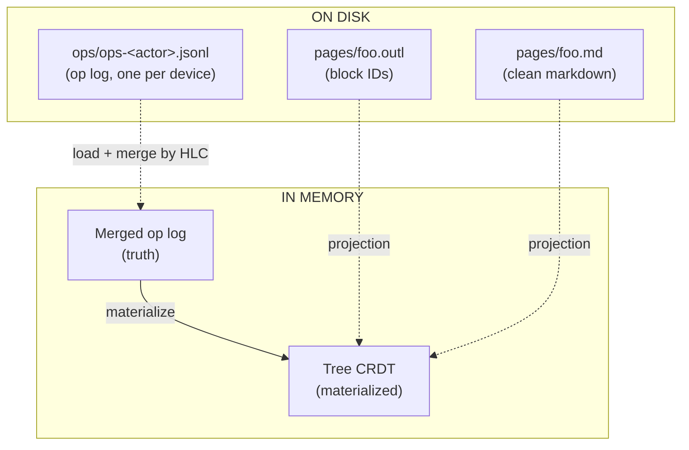
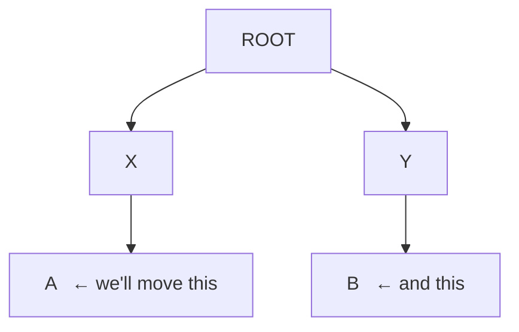
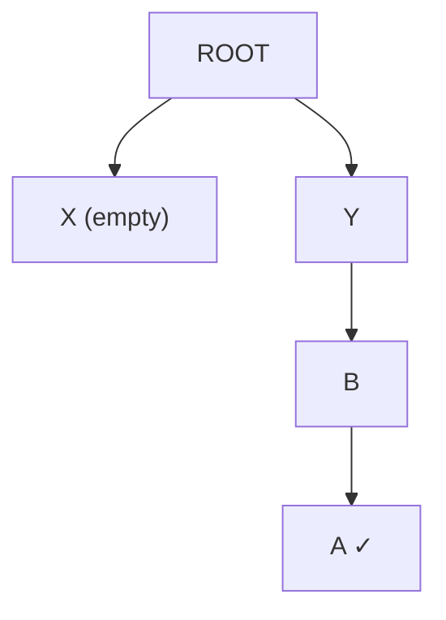
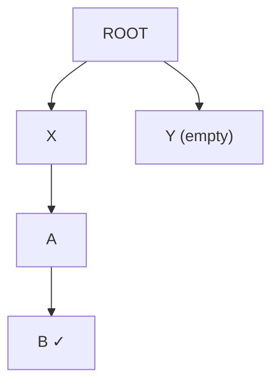

# Sync, done right

This page is the long version. The pitch in one sentence: **outl is
the only outliner whose sync is provably correct, doesn't need a
server, and doesn't pollute your markdown to do it.**

If you want the algorithm walked through with code, jump to the
[Tree CRDT walkthrough](crdt.md). This page is about *why* — what
breaks in the other tools, what's running in production today, and
what's still ahead before we call this "state of the art".

The doc is split in two:

- **[Part 1 — What's in production today](#part-1--whats-in-production-today)**
  is the design that ships now: tree CRDT core, op log on disk, iCloud
  Drive transport, the shared `SyncEngine`, what we explicitly trade
  off to get here.
- **[Part 2 — What's still ahead](#part-2--whats-still-ahead)** is the
  designed-but-not-built work: per-page op log shards for 10k+ pages,
  per-page snapshots, the iroh P2P transport, and the migration path
  from today's layout to that one.

---

# Part 1 — What's in production today

## Where the alternatives break

Both Roam and Logseq got the outliner UX right. Both fall apart on sync.

### Roam Research — sync as a service

Roam keeps every workspace in a central database on their servers.
Real-time sync is great when it works. The cost:

- **Your data lives on their machines.** Export is JSON; the moment
  Roam decides to throttle, raise prices, or shut down, your notes
  are stranded.
- **No offline merge.** Two devices edit the same block while
  disconnected? The one that connects last wins, the other one's
  changes silently vanish. There's no conflict surfaced, no merge
  prompt, no history of what was lost.
- **No interop.** You can't open a Roam graph in another editor.
  There's no `.md` on disk to inspect.

Roam was an inspiration for what an outliner *feels* like. It is not
an example of how to store your thinking.

### Logseq — files on disk, but the merge is hopeful

Logseq fixed the "where do my files live" problem: it writes
markdown. Then it broke the markdown:

```markdown
- ## My block
  id:: 6601a2c1-4f31-4a45-1c2c-3a5e6b7d8f90
  - child block
    id:: 6601a2c1-...
```

Every block gets a UUID written *into the file*. Open it in
VS Code, Obsidian, or `cat`, and it's full of metadata. Worse:

- **Sync is a paid Pro tier.** And it's a file-rsync flavor — there
  is no merge algorithm. When two devices write the same file, the
  newer one wins. Same loss as Roam, just with extra steps.
- **DB version split the community.** Logseq's pivot to a database
  backend left the file-based users behind and shipped half-broken
  for over a year.
- **Mobile is a known-bad experience.** Years of users asking for
  parity.

Logseq pointed at the right idea — files on disk — and stopped
halfway.

### Plain Git — the merge destroys structure

If files are markdown and you want sync, why not just `git`?

```bash
git pull --rebase
# CONFLICT (content): Merge conflict in pages/Avelino.md
```

Git treats the file as a sequence of *lines*. When two people
re-arrange the outline, the lines line up wrong, the merge marker
splits a block in half, and you spend an hour resolving conflicts
by hand. Every move operation in a tree of nested bullets becomes
a textual war.

Try it once. You'll never do it twice.

---

## The architecture: op log + projections

The core idea is two layers:



1. **The op log is the source of truth.** Every change to the tree
   — moving a block, editing its text, setting a property,
   deleting — is recorded as a `LogOp` with a [Hybrid Logical Clock][hlc]
   timestamp. The list of ops, sorted by HLC, deterministically
   produces the tree.

2. **The materialized tree and the `.md` are projections.** Both can
   be thrown away. If your sidecar is lost, `outl doctor` regenerates
   it from the op log. If your `.md` is deleted, the op log still has
   every block.

3. **Markdown on disk is *clean*.** No `id::`, no HTML comments, no
   YAML frontmatter delimiters. Block IDs live in `pages/foo.outl`
   (JSON, next to the `.md`, not dotted — iCloud Documents skips
   dotted paths when syncing across devices). When you edit
   `pages/foo.md` externally, outl's [3-level matching algorithm][matching]
   reconstructs which block had which ID.

[hlc]: https://cse.buffalo.edu/tech-reports/2014-04.pdf
[matching]: markdown-format.md

The pieces that make this work:

| Piece | What it does |
|-------|--------------|
| **Tree CRDT** ([Kleppmann et al. 2022][paper]) | Every device applies ops in HLC order, undoes/replays late arrivals, and provably converges to the same tree. |
| **HLC timestamps** | Total order across devices without coordination. Wall clock + logical counter + actor ID. |
| **Yrs (Yjs in Rust)** | Character-level CRDT for the text *inside* a block. Concurrent edits to the same sentence merge cleanly. |
| **Fractional indexing** | Sibling order as a sortable string. Inserting between two positions doesn't renumber anyone. |
| **Slugified filenames** | `[[Avelino]]` resolves to `pages/avelino.md` with `title:: Avelino` set automatically. The display name stays human; the filename is stable. |

[paper]: https://martin.kleppmann.com/papers/move-op.pdf

---

## Five formal guarantees the CRDT provides

It's worth being specific. The algorithm in outl provides these:

### 1. Strong eventual consistency

Two devices that have observed the same set of ops produce *exactly*
the same tree, regardless of delivery order or duplication.

Tested via `convergence.rs`: three replicas apply 100+ ops in three
different permutations and the resulting trees are byte-identical.

### 2. Commutativity after reordering

The order in which a replica *receives* ops doesn't matter. Internally
the algorithm undoes newer ops, applies the late arrival in HLC
position, then replays the undone ones. The user-visible state is the
same as if everything had arrived in HLC order from the start.

### 3. Idempotency

Applying the same op N times is the same as applying it once. You can
re-sync a workspace that's already in sync and nothing changes.
Tested in `idempotency.rs`.

### 4. Tree invariant preservation

The materialized tree is always a valid tree. No node ever has two
parents. No cycle ever forms. Every node is reachable from `ROOT` or
the soft-delete bucket `TRASH_ROOT`. Tested in `cycle.rs` and
`cycle_chain.rs`.

### 5. No silent loss

Every op delivered to `apply_op` ends up in the log. Including the
ones turned into no-ops by cycle detection. Nothing is ever silently
dropped — if it was, the algorithm couldn't replay history correctly.

The first four are properties Roam/Logseq can't even claim. The fifth
is why outl can offer time-travel later (it's the entire premise of
the [ChronDB backend][chrondb] tracked in issue #1).

[chrondb]: https://github.com/avelino/outl/issues/1

---

## The hard case Roam and Logseq lose

Two devices, offline, both move the same block:

Initial state on both devices:



**Device 1** moves `A` to be a child of `B`:



**Device 2** moves `B` to be a child of `A`:



Both are sensible local edits. Now they sync.

- **Roam** has no story — last write wins by wall-clock time.
- **Logseq sync** rsyncs the files; one device's edit replaces the
  other's. Information lost.
- **Git merge** sees two changed `.md` files, gives you a conflict
  with `<<<<<<<` markers across nested bullets, and you spend the
  next hour repairing your outline.

**outl** does this:

1. Both devices receive both ops via the transport.
2. Each device sorts the two ops by HLC. The earlier one applies
   normally.
3. The later one would close a cycle (A under B, B under A — a
   loop). The algorithm detects this **as a deterministic no-op on
   the materialized tree**, but the op stays in the log.
4. Both devices end up with the same final tree — exactly one of the
   two moves applied. No data loss. No conflict to resolve manually.

The op that became a no-op isn't discarded: if a future op breaks the
loop (someone moves a third block out), the algorithm can replay
history and find that the no-op move is now valid. The system never
forgets what you intended.

This worked example is implemented as the `cycle.rs` test in
`outl-core`. Every change to the algorithm has to pass it.

---

## Why not just use Automerge?

[Automerge][automerge] is a great general-purpose CRDT. Why didn't
we use it?

- **Tree CRDT specifically.** Automerge has tree support but it's
  experimental, and we'd need to bolt on the move-with-cycle logic
  ourselves. Better to implement Kleppmann's algorithm directly — it
  fits in ~300 lines of Rust and we control the entire on-disk format.
- **Domain semantics.** Our `Op` enum talks about `Move(node,
  new_parent, position)` and `SetProp(node, key, value)`. Automerge
  is generic — every operation goes through a JSON-patch-like API.
  Specialization makes error messages and tests dramatically clearer.
- **Storage control.** We own the SQLite schema, the bincode
  serialization of ops, and the bytes that go on the wire. With
  Automerge we'd be locked into their binary format forever.

The cost: we're on the hook for correctness. That's why
[the test battery][tests] is huge and the coverage target on the
four critical functions (`do_op`, `undo_op`, `apply_op`,
`creates_cycle`) is **100% — no exceptions**.

[automerge]: https://automerge.org/
[tests]: https://github.com/avelino/outl/tree/main/crates/outl-core/tests

---

## Transport: iCloud Drive

The algorithm runs on every device; the transport is whatever ships
each actor's `ops-*.jsonl` to every other device. Today that is
iCloud Drive, used by the iOS mobile client and reachable from the
macOS TUI by pointing `--path` at the same iCloud ubiquity container
(`~/Library/Mobile Documents/iCloud~app~outl~mobile-app/Documents`).

The layout is:

```
<container>/Documents/
├── journals/YYYY-MM-DD.md
├── pages/<slug>.md
├── pages/<slug>.outl                ← sidecar
└── ops/
    ├── ops-<this_device>.jsonl      ← only this device writes here
    ├── ops-<other_device>.jsonl
    └── ...
```

Each device only writes its own `ops-<actor>.jsonl`. iCloud syncs
each file independently. When a peer's jsonl arrives, the local
client merges it with the others by HLC and replays through the
move-op algorithm. The materialised `.md` + sidecar then get
re-projected from the new tree.

Two iCloud-specific decisions fall out of this transport:

- **The ops directory is `ops/`, not `.ops/`.** iCloud Documents
  silently skips dotted paths across devices. Same rule keeps the
  sidecar at `pages/foo.outl` rather than the original `.foo.outl`.
- **Peer files must be force-materialised before reads.** iCloud
  syncs metadata before content; a `std::fs::open` on a freshly
  notified file may read an empty placeholder. The mobile client
  wraps every read in `NSFileCoordinator` after calling
  `startDownloadingUbiquitousItemAtURL` so the Rust side never sees
  a placeholder. Details in
  [`crates/outl-mobile/CLAUDE.md`](../crates/outl-mobile/CLAUDE.md#peer-file-materialisation-the-icloud-catch).

---

## The shared sync engine

Both clients (TUI and mobile) use `outl_actions::SyncEngine` for the
reload-workspace + reproject-page flow. **Detection** is
client-specific (each transport has its own notification mechanism),
**policy** is client-specific (the TUI defers reloads while the user
is in Insert mode; mobile commits each mutation atomically), **the
work itself is shared**.

```rust
let engine = SyncEngine::new(workspace_root, actor);
let fresh = engine.reload_workspace()?;          // merge every peer jsonl
engine.reproject_page(&fresh, focused_page_id)?; // rewrite the focused .md + sidecar
```

| Method | What it does |
|--------|--------------|
| `reload_workspace()` | Reopens the workspace from disk, merging every `ops-<actor>.jsonl` by HLC and replaying through the move-op algorithm. |
| `reproject_page(ws, page_id)` | Re-emits the page's `.md` + sidecar from the materialised tree. Other pages get re-projected lazily when the user navigates to them. |
| `refresh_page(page_id)` | Convenience: reload + reproject in one call. The typical "peer fired, pull the new state in" entry point. |
| `snapshot()` | Lists every `ops-*.jsonl` in the workspace with size + mtime. Used by polling detectors (TUI) to decide whether to fire a reload. |
| `snapshot_peers()` | Like `snapshot()` but **filters out the local actor's file**. Reacting to your own writes closes a destructive save-reload-race loop; only peer files should trigger reloads. |
| `scan_for_orphans()` | Walks `journals/` and `pages/` for `.md` files whose sidecar is missing or whose `last_synced_hash` no longer matches the file's current hash. Both conditions mean the op log doesn't reflect this content yet (fresh import, peer-shipped projection without sidecar, vim edits). Each path feeds `outl_md::reconcile::reconcile_md`. |

### TUI policy: defer reloads while typing

The TUI has an Insert mode with an in-memory `ParsedPage` AST that
hasn't been written back to the op log yet. A reload mid-edit would
swap the workspace under the cursor and the user's keystrokes would
land on the new AST. The poller therefore checks mode:

```rust
if matches!(self.mode, Mode::Insert { .. }) {
    self.pending_reload = true;   // defer
    return false;
}
self.reload_workspace_from_disk(); // safe now
```

When the user commits (Esc, Enter, structural ops), the commit path
drains `pending_reload` and runs the deferred reload. The local edit
is now a real op in the log; the peer's ops merge in; the CRDT does
its job.

### Mobile policy: every mutation is atomic

Mobile commits every mutation as one Tauri command. There is no
multi-keystroke window where a reload could clobber unsaved state, so
the watcher applies reloads immediately. Same engine, simpler policy.

### Orphan scanning

`scan_for_orphans()` is the entry point for `.md` files that arrived
without an op-log history: a user dumps a Roam export into
`journals/`, a peer ships only the projection, someone edits a `.md`
in vim and saves. The TUI runs the scan every 10 seconds on a worker
thread; mobile runs it once at boot. Both call into
`outl_md::reconcile::reconcile_md`, which uses 3-level matching to
emit the minimum ops that translate the on-disk state into the op
log.

---

## Honest trade-offs (today)

Be skeptical of any sync story that claims zero compromises. Here are
ours:

- **One move wins per concurrent pair.** If you and your friend both
  move block B to different parents at the same time, exactly one
  move is materialized. The other goes into the log but doesn't take
  effect. Pretending both succeed would lose information — that's
  Logseq's mistake.
- **Text-level undo through Yrs is partial.** Block text is a Yrs
  document. Yrs guarantees character-level convergence, but reversing
  a single `Edit` op via `undo_op` may not produce the exact
  pre-edit string if other edits interleaved. The string still
  converges; only the local `undo` semantics weaken. Documented at
  `crdt.md#text-content`.
- **Conflict surfacing is silent.** Today outl just resolves and
  moves on. A future feature could pop up "concurrent edits on this
  block" the way Notion does. Not now.
- **No causal delivery enforcement.** HLC is total order, not
  causal. In practice this is fine — `apply_op` handles any delivery
  order — but we don't promise vector-clock semantics.
- **Single jsonl per device caps practical scale.** Today everything
  the device has ever done lives in one `ops-<actor>.jsonl` file. The
  whole file gets loaded at boot. Works comfortably up to roughly
  **1k pages × 50 ops/page = 50k ops** (boot 0.5–5 s, memory
  proportional to the history). Beyond that we need per-page op log
  shards — designed in Part 2.
- **iCloud is a third-party transport.** It's the v0 shortcut for
  shipping a working multi-device experience without writing
  network code. Replacing iCloud with iroh (Part 2) removes the
  dependency on a cloud provider and brings non-Apple devices into
  the same sync pool, without changing the algorithm or the
  on-disk layout.

---

# Part 2 — What's still ahead

What's in Part 1 ships and works. What follows is designed,
referenced from the code, and waiting for the right moment to land —
the order is roughly the order in which we expect the constraints to
bite.

## Phase A — Per-page op log shards (for 10k+ pages)

### Why the monolithic jsonl breaks at scale

The current layout has one `ops-<actor>.jsonl` per device for **the
entire workspace**. Boot replays the full file; memory holds every
op in history. Past ~1k pages × 50 ops/page the boot starts showing
visibly (1–5 s on a laptop, more on a phone), and the iCloud
sync window for a single growing file gets wider as the file grows.

### New layout

```
ops/
├── <page-slug>/
│   ├── ops-<actor>.jsonl              ← ops for this page, this actor
│   └── ops-<peer-actor>.jsonl         ← ops for this page, synced from a peer
├── <other-page-slug>/
│   └── …
└── global/
    └── ops-<actor>.jsonl              ← cross-page ops (move block between pages)
```

Each page gets its own op log directory. iCloud syncs page by page.
Reading "ops for this page" is `O(ops_for_this_page)`, not
`O(total_ops)`.

### Boot

```
list_pages()           → walk pages/ and journals/ on the filesystem  (O(pages))
                         ↑ doesn't touch the op log
open_page(slug):
    read ops/<slug>/ops-*.jsonl
    materialise just this page
    render → outline
```

Boot total = **O(pages)** to list + **O(ops for the home page)** to
show. Independent of total history size.

### Single-page mutations

The vast majority (edit, toggle TODO, indent, delete, create_after):

```
mutation → workspace.apply(op) with page_id implicit
         → append to ops/<slug>/ops-<actor>.jsonl
         → render .md + sidecar (already loaded for this page)
```

Cost: `O(1)` append + `O(blocks_in_page)` render.

### Cross-page mutations

Rare but real (dragging a block to another page, refactors):

```
cross-page mutation → append to ops/global/ops-<actor>.jsonl
                    → also touch the two affected pages
```

Boot needs to replay the global ops too. The `global/` directory is
expected to stay small in normal use.

### Incremental sync

When iCloud delivers a new `ops/<slug>/ops-<peer>.jsonl`:

- the watcher (`NSMetadataQuery`) fires *for that page*
- only that page reloads (not the whole workspace)
- the local `.md` + sidecar for that page get re-projected

There's no "reload everything" path anymore. Granularity stays at
the page.

## Phase B — Snapshots

Even with per-page op logs, a very active page (1k+ ops) still pays
the replay cost on open.

```
journals/2026-05-29.md
journals/2026-05-29.outl              ← sidecar (block ids + hashes)
ops/2026-05-29/
   ├── snapshot.bin                   ← serialised materialised state (binary)
   ├── snapshot.cursor                ← last HLC included in the snapshot
   ├── ops-<actor>.jsonl              ← ops since the snapshot
   └── ops-<peer>.jsonl
```

Opening a page:

1. Read `snapshot.bin` → materialised base state (fast, binary).
2. Read ops past `snapshot.cursor` → apply delta.
3. Render.

Snapshots get re-compacted every N=200 ops or on a periodic schedule.
Trade-off:

- stale snapshot → more ops to replay on open
- fresh snapshot → more I/O on every write

Working rule: each `apply_page_md_with_sidecar` checks whether the
ops since the snapshot exceed N; if so, re-snapshot.

## Phase C — iroh transport (replaces iCloud)

iCloud is the v0 transport. Phase C swaps it for [iroh][iroh] so the
project stops depending on a third-party cloud and starts working
across non-Apple devices:

- QUIC + automatic hole punching. No central server. No STUN/TURN
  unless your network is genuinely awful.
- Discovery via shareable ticket: `outl share` prints a string, the
  other device runs `outl join <ticket>`, both are now in the same
  swarm.
- Each replica keeps a vector clock (`last_ts_per_actor`). The sync
  protocol sends only the ops the other peer hasn't seen.
- E2E encrypted by default. Your notes never leave the devices you
  own.

[iroh]: https://www.iroh.computer

The algorithm doesn't change between transports. iCloud-today and
iroh-tomorrow both deliver per-actor jsonls; the CRDT handles
arrival order, duplication, and delay regardless of which medium got
the bytes there. The `outl-actions::SyncEngine` API stays the same
— only the *detector* (replaces `NSMetadataQuery` / file polling
with iroh event streams) changes.

## Migration path

Workspaces from Part 1 have a monolithic `ops/ops-<actor>.jsonl`.
The migration to per-page shards is one-shot and idempotent:

```
outl migrate-to-per-page-ops --path <root>
  for each op in ops-<actor>.jsonl:
      identify page-slug (parent walk + earlier Create ops)
      dispatch to ops/<slug>/ops-<actor>.jsonl
  ops with no page-slug → ops/global/ops-<actor>.jsonl
  rename ops-<actor>.jsonl → ops-<actor>.jsonl.v0.bak
```

Reversible via restoring the `.bak`. No change to the `.md` + `.outl`
wire format, so older clients reading the projection still work
during the transition.

### API impact

- `outl-core::JsonlStorage` gains a `PageScope` concept (today: one
  scope per workspace; Part 2: one per page). Backward compatibility:
  `PageScope::Global` matches today's behaviour byte for byte.
- `outl-actions::open_or_create` keeps the same signature.
  Internally it dispatches to the right scope based on the page-slug
  property.
- Mobile: `JsonlStorage::open` at boot only for preflight. Each Tauri
  command that opens a page calls `open_page_scope(slug)`.
- TUI: same. `App::new` no longer materialises the entire workspace;
  it calls `open_page_scope` lazily on navigation.

### Order of execution

1. Implement `PageScope` in `JsonlStorage` and the `Storage` trait
   (backward compatibility via `PageScope::Global`).
2. Add `outl-cli migrate-to-per-page-ops` + tests.
3. Update mobile to use scopes in every Tauri command.
4. Update TUI likewise.
5. Add snapshots (Phase B — independent, can land as a follow-up).
6. Document the cross-page operation trade-off in the migration notes.

---

## Going deeper

- **[Tree CRDT walkthrough](crdt.md)** — the algorithm with code,
  worked examples, and the full invariant list.
- **[Markdown dialect + matching](markdown-format.md)** — how
  external edits get reconciled with the sidecar.
- **[Storage trait](storage.md)** — why `Storage` is a trait and how
  the ChronDB backend slots in.
- **[Clients](clients.md)** — how the TUI and mobile share the
  `SyncEngine` and where they diverge.
- **Original paper:** Kleppmann, Mulligan, Gomes, Beresford.
  *"A highly-available move operation for replicated trees."* IEEE
  TPDS 2022. <https://martin.kleppmann.com/papers/move-op.pdf>
